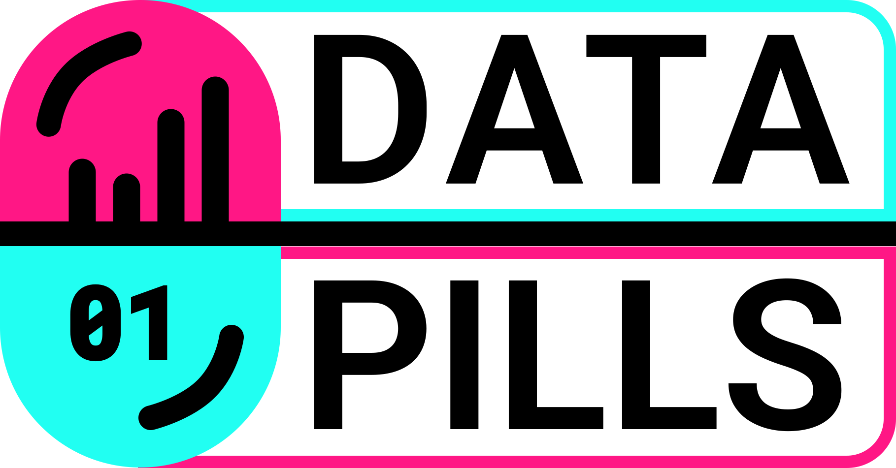
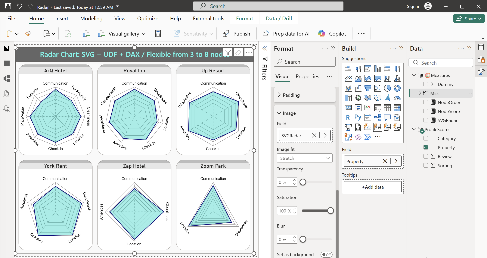

# Dynamic Radar Charts for Power BI

**Fully dynamic Radar Charts in Power BI using only DAX + SVG + UDF**

A flexible solution that automatically generates Radar Charts with any number of nodes (3 to 8), concentric rings, axis guides, and smart auto-rotated labels.



## Features

- Dynamic nodes from **3 to 8** based on your data
- Concentric rings, axis guides and auto-rotated labels
- Intelligent label rotation (perpendicular "T" style on 5 and 7 nodes)
- Fully customizable colors
- Works in Table visuals, multi-row Cards and Image visuals

## Repository Files

| File                    | Description |
|-------------------------|----------------------------------------------------|
| `Radar.pbix`            | Ready-to-use Power BI file (recommended)           |
| `Table&Measure.TMDL`    | TMDL script with sample table + all measures       |
| `Radar_UDFs.TMDL`       | All User-Defined Functions (TMDL format)           |
| `SampleTable.txt`       | Optional DAX code for sample table                 |
| `Measures.txt`          | Optional DAX code for measures                     |

## Prerequisites

- **Power BI Desktop** version **2.120 or later** (required for full UDF and TMDL support)

## Quick Start (Recommended)

1. Download the **`Radar.PBIX`** file
2. Open it in Power BI Desktop
3. Replace the data in the `ProfileScores` table with your own data
4. Customize colors in the `SVGRadar` measure if desired
5. Done! Your dynamic Radar Charts are ready

## Preview

  
*(3, 4, 5, 6, 7 and 8 nodes)*

## How to add to your existing PBIX

1. Open your PBIX file
2. Switch to **TMDL View** (click the TMDL icon on the left sidebar)
3. Paste the content of **`Radar_UDFs.TMDL`** and click **Apply changes**
4. Paste the content of **`Table&Measure.TMDL`** and click **Apply changes**
5. Go to **Report View** and build your visualization:
   - Add a **Button Slicer** visual and use the `[Property]` field
   - Add an **Image** visual (or Card) and place the `SVGRadar` measure in the Image Field
   - Set **Image Fit** to **Stretch**

## Default Colors

```dax
AreaHexColour = "#00D4C6"   // Fill color of the radar area
EdgeHexColour = "#101080"   // Border color
```

## Author
**Miguel Madriz** – Data Pills Series
